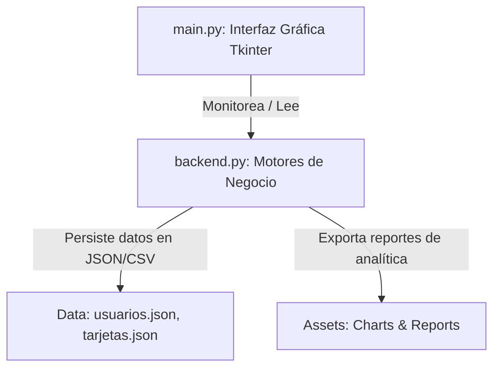

# MANUAL DE FUNCIONAMIENTO Y GUÍA DE EXPOSICIÓN: RUTA APP (PUEBLA 2026)

Este documento detalla el funcionamiento interno, diseño técnico y guía práctica de uso para **RUTA APP**, el sistema de gestión y enrutamiento inteligente de transporte estudiantil con subsidio estatal (50% de descuento SEP) para universitarios de **BUAP**, **TEC DE MONTERREY** e **IPN** en el estado de Puebla.

---

## 1. ARQUITECTURA GENERAL DEL SISTEMA (FUNCIONAMIENTO A DETALLE)

El software está estrictamente diseñado bajo el paradigma de **Programación Orientada a Objetos (POO)** y desacoplado en dos módulos principales:

### A. Módulo de Backend (`backend.py`)
Encapsula toda la lógica de control, algoritmos y almacenamiento persistente:
*   **Jerarquía de Usuarios (Herencia y Polimorfismo)**: La clase abstracta `Usuario` define las bases de validación de campos seguros. Las clases `Pasajero` (que añade historial de viajes) y `Administrador` (que implementa control de sobrecupos y asignación de unidades) heredan de ella.
*   **Polimorfismo en Tarifas e Inteligencia de Tarjetas (`TarjetaMovilidad`)**: Gestiona saldos y calcula cobros dinámicos según el tipo de subsidio escolar (el descuento BUAP/Tec/IPN aplica un 50% de cobro sobre la tarifa estándar).
*   **Algoritmo de Enrutamiento Óptimo (`DijkstraRouter`)**: Implementación pura sobre grafos del algoritmo de **Dijkstra** para calcular la trayectoria con menor kilometraje entre paradas de transbordo inter-universidades.
*   **Motor de Simulación en Tiempo Real (`SimulationEngine`)**: Simula el trayecto en caliente (lerp) de los autobuses sobre las coordenadas del mapa escolar. Controla los aforos de pasajeros simulados con curvas de afluencia Gaussianas para la analítica avanzada.
*   **Persistencia Segura e Integridad con Hash (`DataManager` e `IntegrityAuditor`)**: Guarda datos en archivos JSON y CSV. Genera firmas hash SHA-256 para auditar transacciones e impedir fraude de saldos.

### B. Módulo de Frontend (`main.py`)
Implementa la interfaz gráfica (GUI) Premium bajo Tkinter de alto rendimiento:
*   **Controlador Central (`TransporteApp`)**: Orquesta las dimensiones de ventana, el bucle continuo del hilo de telemetría (`.after()`), y las transiciones animadas de los marcos (`tk.Frame`).
*   **Login & Registro Dinámico**: Integra el nuevo logotipo de **RUTA APP** y campos dinámicos que ocultan o muestran los módulos de verificación SEP según la universidad seleccionada.
*   **Dashboard del Pasajero**: Muestra una tarjeta bancaria animada en HSL según el color institucional de tu escuela. Integra una pasarela de pago para recargas y el planificador Dijkstra en vivo.
*   **Mapa Interactivo**: Canvas dinámico que plotea los buses en movimiento sobre los trayectos escolares cargando imágenes vectoriales personalizadas.
*   **Consola de Administración y Pandas**: Lanza análisis sobre el dataset histórico de abordajes usando **Pandas** y renderiza gráficos estadísticos complejos generados mediante **Matplotlib**.

---

## 2. GUÍA DE USO PASO A PASO (CÓMO USARLO)

### Paso 1: Inicio de Sesión o Registro
Al arrancar la aplicación, verás una interfaz oscura premium con el **logotipo oficial de RUTA APP** centrado.

*   **Para entrar como Estudiante BUAP (Datos semilla)**:
    *   **Correo**: `alan.garcia@buap.mx`
    *   **Contraseña**: `123456`
*   **Para entrar como Administrador de Red**:
    *   **Correo**: `rodrigo.admin@transpuebla.com`
    *   **Contraseña**: `123456`

Si decides registrarte:
1.  Haz clic en `"REGISTRARSE Y VALIDAR DESCUENTO"`.
2.  Elige tu universidad (**BUAP**, **TEC DE MONTERREY** o **IPN**).
3.  Ingresa tu correo institucional (el sistema validará con `SchoolDiscountValidator` que el dominio sea correcto, por ejemplo `@buap.mx`).
4.  Ingresa tu matrícula de control escolar (se validará contra la firma digital SEP).
5.  ¡Se expedirá tu tarjeta inteligente con `$30.00 MXN` de saldo de regalo!

### Paso 2: Portal del Estudiante (Dashboard)
Una vez iniciada la sesión como estudiante:
1.  **Visualizar Tarjeta**: Verás tu tarjeta con los colores de tu institución y tu saldo actual actualizado en caliente.
2.  **Recargar Saldo**: Selecciona un monto en el menú desplegable (`$20`, `$50`, `$100`, `$200`) y haz clic en `"PROCESAR RECARGA"`. La pasarela virtual acreditará el saldo al instante.
3.  **Planificar Ruta (Dijkstra)**: Ve a la pestaña `"Planificar Ruta Optima"`. Elige tu parada de origen y de destino, haz clic en `"CALCULAR CAMINO CORTO"`. El enrutador mostrará el itinerario detallado paso a paso con los tiempos estimados de arribo y conexiones requeridas.
4.  **Monitorear Mapa en Vivo**: Haz clic en `"VER SIMULADOR EN VIVO (MAPA)"`. Podrás observar a los autobuses escolares desplazarse en tiempo real de parada en parada.

### Paso 3: Consola de Administración
Inicia sesión como administrador para gestionar la red de transporte:
1.  **Bitácora de Sobrecupos**: Verás las alertas en tiempo real de autobuses saturados generadas por los estudiantes en Puebla.
2.  **Despachar Refuerzos**: Si una unidad reporta sobrecupo, selecciona `"DESPACHAR REFUERZO AUXILIAR"` para enviar un autobús vacío de apoyo en caliente.
3.  **Visualizar Analítica Pandas**: El panel derecho cargará automáticamente el dataset histórico de viajes y exportará un gráfico de barras bimestral de uso mediante **Matplotlib**, visualizando las horas pico y la afluencia de pasajeros.

---

